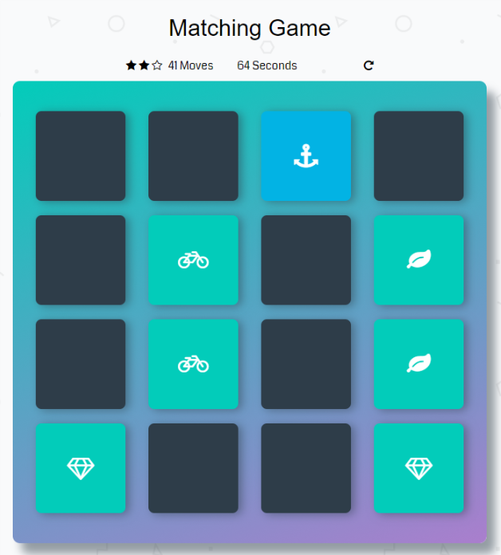

<h1>Memory Game Project</h1>

<h2>玩法介绍</h2>

游戏板由布置在网格中的十六个卡片组成。 卡片由八种不同的牌组成，每张牌在一侧各有不同的符号。 卡片随机排列，符号面朝下。 游戏规则非常简单：一次翻转两个卡片，找到匹配的卡!

每一回合

<ul>
  <li>玩家翻转一张卡，显示其底层符号。</li>
  <li>然后播放器转过第二张卡，试图找到相同符号的相应卡片。</li>
  <li>如果卡匹配，两张卡都保持翻转。</li>
  <li>如果卡不匹配，则两张卡都朝下翻转。</li>
</ul>

一旦所有卡都正确匹配，游戏就会结束。

   

上图为游戏进行中的样子。当两次翻转的符号相同时，将两张卡片保持翻转。图中还有评分星级，点击数，耗时

当所有的卡片都匹配后，弹出游戏结束界面，显示本次游戏星级评分，总共点击数，所消耗时间
